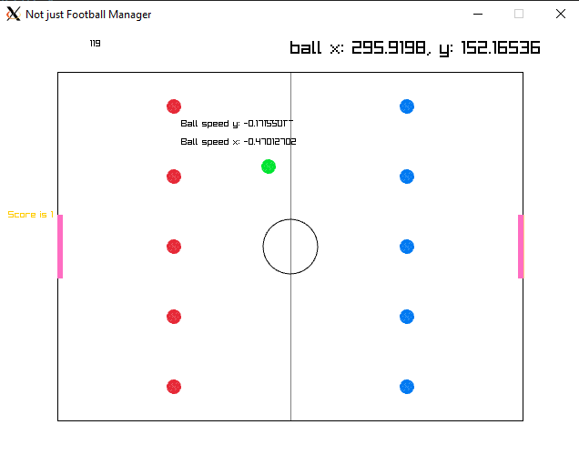

## Generic 2D football Project

Hi, welcome to this small repo, i'm working on a sort-of 2d football simulator, there's some general long term goals, but it is really for a bit of fun and to learn more rust.

~~The initial goal is to render 2 teams of 5 players on a pitch, then it's to try & get them to move randomly on the screen.~~

~~Perhaps try and enable some user input?~~

Todo: 
* Reset positions / board after goal is scored
* Keep score in top left
* Add (for now random) movements to players
* Scope kicking ability to being within a vicinity of the ball
* (maybe) Restrict angle of force to apply to ball based on the relative position of the player to the ball? ie, player can't kick the ball backwards (or at least, not as forcefully or accurately) as kicking forwards
* (maybe) Make the ball spring when player kicks
* ...

Then after the engine is good enough:
* write gamestate to redis? get python daemon to read from it & write actions for the players
* train ai's for each team
* &/or train ai's for each player
